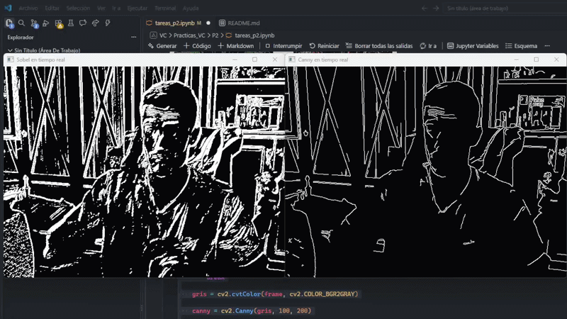
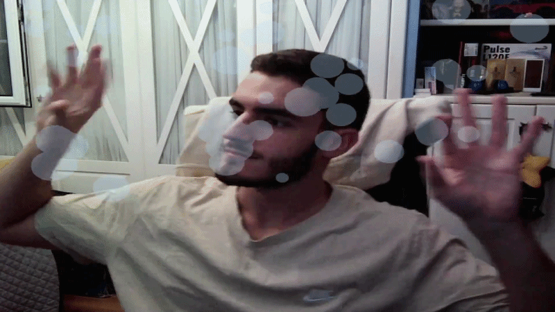
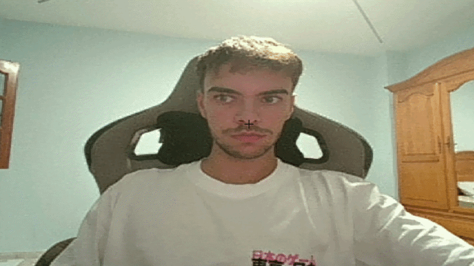

# Práctica 2

Este repositorio contiene el cuaderno `tareas_p2.ipynb`, con tres tareas: conteo de píxeles sobre bordes de Canny, comparación con Sobel umbralizado y detector de movimientos más detector de piel. Se han añadidos dos ampliaciones:
    Detección de bordes Canny/Sobel en tiempo real
    Detección de rostros con YuNet

### 👥 Autores:
- [Enrique Sosa Ojeda](https://github.com/Enric1005)
- [Vidal de León Giménez](https://github.com/t3ntox)

------

## Archivos necesarios

- `mandril.jpg` — imagen utilizada en las Tareas 1 y 2 y en la ampliación de la Tarea 3 (como imagen que oculta los rostros).
- `face_detection_yunet_2023mar.onnx` — modelo preentrenado de detección de rostros usado en la ampliación de la Tarea 3 (descargable desde [OpenCV Zoo](https://github.com/opencv/opencv_zoo/tree/main/models/face_detection_yunet)).

## Tarea 1 — Conteo de píxeles blancos por filas con Canny

En esta primera tarea, la imagen se convierte a escala de grises y se le aplica `cv2.Canny(gris, 100, 200)`, obteniendo una imagen binaria (0/255) con los bordes detectados.

Una vez se tiene el resultado, el conteo de píxeles blancos por fila se hace con `cv2.reduce(canny, 1, cv2.REDUCE_SUM, dtype=cv2.CV_32SC1)`, que suma los valores de cada fila (el `1` indica reducción a lo largo del eje horizontal, colapsando columnas). El resultado, `fil_counts`, es un array de una columna con la suma total de cada fila.

Para expresarlo como porcentaje, se normaliza dividiendo entre `255 * canny.shape[1]` (255 al ser el valor máximo de píxel, y el número de columnas al ser el máximo número de píxeles blancos posibles en una fila).

Se calcula el valor máximo (`umbral = max(fil_counts) * 0.9`) y se seleccionan con `np.where(...)` las filas cuyo conteo lo supera. Estas filas se marcan sobre la imagen de Canny con `plt.axhline()`, una línea horizontal roja por cada fila destacada. En paralelo, se muestra una gráfica de líneas con el porcentaje de píxeles blancos por fila, para visualizar la distribución completa.

### Resultados


## Tarea 2 — Umbralizado de Sobel y comparación con Canny

Una vez ya se conocen los resultados obtenidos con Canny, en esta tarea se busca comparar dichos resultados con los que daría otro método de detección de bordes, en este caso el llamado Sobel.

**Cálculo de Sobel:** el proceso se encapsula en la función `sobel_umbralizado(img, umbral)`, definida en un bloque de imports que hay que ejecutar antes de cualquier código de esta tarea (y que se reutiliza en su ampliación). Esta función realiza:
1. Se suaviza la imagen en grises con `cv2.GaussianBlur(img, (3,3), 0)` para reducir ruido de alta frecuencia antes de derivar.
2. Se calculan los gradientes en ambas direcciones con `cv2.Sobel(ggris, cv2.CV_64F, 1, 0)` (horizontal) y `cv2.Sobel(ggris, cv2.CV_64F, 0, 1)` (vertical), usando profundidad `CV_64F` para no perder valores negativos del gradiente.
3. Ambos gradientes se combinan con `cv2.add()` y se convierten a 8 bits con `cv2.convertScaleAbs()`, ya que `cv2.threshold` requiere una imagen de este tipo.
4. Se umbraliza con `cv2.threshold(cvt_sobel, umbral, 255, cv2.THRESH_BINARY)` (en esta tarea `umbral = 90`), obteniendo una imagen binaria equivalente a la de Canny.

Tras obtener la imagen resultante, se aplica la misma lógica de `cv2.reduce()` de la Tarea 1, pero esta vez también por columnas (`cv2.reduce(imagenUmbralizada, 0, ...)`, con el `0` indicando reducción por columnas). Se obtienen así cuatro conjuntos: filas y columnas destacadas para Sobel, y filas y columnas destacadas para Canny (recalculado igual que en la Tarea 1).

Con todos los resultados requeridos, se muestran ambas imágenes en subplots (`plt.subplot(1,2,...)`), Canny con líneas verdes (`axhline`/`axvline`) y Sobel umbralizado con líneas rojas, permitiendo comparar visualmente qué filas y columnas destaca cada método.

**Comparación:** en el caso de las filas, ambos métodos coinciden en las filas destacadas, pero Sobel umbralizado obtiene un número significativamente mayor. En el caso de las columnas, de nuevo hay coincidencias, pero es Canny quien detecta un número total de columnas significativamente mayor.

### Resultados


## Ampliación Tarea 2 — Umbralizado de Canny y Sobel en tiempo real

Como ampliación, se aplican los dos métodos de detección de bordes sobre el vídeo de la webcam en tiempo real:

1. Se captura vídeo con `cv2.VideoCapture(0)` y en cada frame se convierte a escala de grises.
2. Canny se obtiene con `cv2.Canny(gris, 100, 200)`.
3. Sobel se obtiene reutilizando la función `sobel_umbralizado(gris, valorUmbral)` de la Tarea 2, con un umbral de `50`.
4. Cada resultado se muestra en su propia ventana (`'Sobel en tiempo real'` y `'Canny en tiempo real'`), lo que permite comparar ambos métodos a la vez.
5. El bucle termina al pulsar `Esc`.

### Resultados




## Tarea 3 — Demostradores de visión en tiempo real: movimiento y color de piel

A partir de los vídeos [My little piece of privacy](https://www.niklasroy.com/project/88/my-little-piece-of-privacy), [Messa di voce](https://youtu.be/GfoqiyB1ndE?feature=shared) y [Virtual air guitar](https://youtu.be/FIAmyoEpV5c?feature=shared), se propone reinterpretar la parte de procesamiento de la imagen. La tarea se compone de una función común y dos demostradores independientes construidos sobre ella, ambos basados en detección de movimiento sobre color de piel: uno con efecto de burbujas, inspirado en *Messa di voce*, y otro con efecto de estela. En ambos, pulsar `c` reinicia el efecto visual remanente.

Para el desarrollo del código de esta tarea, nos hemos ayudado de Claude, un modelo de IA, y de documentación sobre la librería OpenCV. Todo esto, con el fin de conocer formas óptimas para la detección del color piel y funciones nativas de la librería que pudiesen facilitar el trabajo.

### Función común: `mascara_mov_piel(frame, pframe, kernel)`

Usada por los dos demostradores (hay que ejecutar antes su bloque de código, que incluye también los imports), combina detección de color de piel y detección de movimiento para aislar únicamente la piel que se está moviendo en cada frame:

1. **Máscara de color de piel**: convierte el frame a espacio **YCrCb** (`cv2.cvtColor(frame, cv2.COLOR_BGR2YCrCb)`) y aplica `cv2.inRange(ycrcb, (0, 133, 77), (255, 173, 127))`, un rango fijo sobre los canales Cr/Cb característico de tonos de piel. El canal Y (luminancia) se deja sin restringir (`0-255`) para que la máscara sea más robusta ante cambios de iluminación.
2. **Limpieza morfológica de la máscara de piel**: `cv2.morphologyEx(..., cv2.MORPH_OPEN, kernel)` elimina ruido puntual (píxeles sueltos mal clasificados como piel), y `cv2.MORPH_CLOSE` rellena pequeños huecos dentro de las regiones de piel detectadas.
3. **Máscara de movimiento**: se calcula la diferencia absoluta entre el frame actual y el anterior, ambos convertidos a gris (`cv2.absdiff` + `cv2.cvtColor(..., COLOR_BGR2GRAY)`), y se umbraliza con `cv2.threshold(dif, 80, 255, cv2.THRESH_BINARY)`.
4. **Combinación**: `cv2.bitwise_and(mov, mask)` se queda solo con los píxeles que son a la vez "movimiento" y "piel", descartando movimiento de objetos sin color de piel y piel estática. El resultado se dilata (`cv2.dilate(..., iterations=2)`) para compactar la región detectada.

### Demostrador 1 — Burbujas sobre movimiento de piel (inspirado en *Messa di voce*)
1. Por cada frame, se obtiene `mov_piel` con la función anterior y se extraen las coordenadas de los píxeles activos con `np.nonzero(mov_piel)`.
2. El número de burbujas nuevas por frame se calcula proporcional al tamaño de la zona detectada: `n = min(4, len(xs) // 150)`, limitando a un máximo de 4 por frame y a `MAX_BURBUJAS = 50` burbujas vivas simultáneas.
3. Cada burbuja nueva (`nueva_burbuja()`) nace en una posición aleatoria dentro de la zona detectada (`random.sample` sobre los índices de píxeles activos) y se le asignan propiedades aleatorias: radio, velocidad vertical (inversamente proporcional al radio, para que las burbujas pequeñas suban más rápido), fase y amplitud de oscilación horizontal, y vida útil en frames.
4. En cada iteración, `actualizar_y_dibujar()` actualiza la posición de todas las burbujas vivas (ascienden en Y, oscilan en X mediante una función seno sobre su fase) y descarta las que ya cumplieron su vida útil o salieron de la imagen por arriba.
5. Las burbujas se dibujan como círculos rellenos (`cv2.circle`) sobre una copia del frame, que luego se mezcla con el frame original mediante `cv2.addWeighted(relleno, 0.3, img, 0.7, 0, img)` para lograr un efecto translúcido en vez de burbujas sólidas.
6. Pulsar `c` vacía la lista de burbujas (`burbujas[:] = []`), reiniciando el efecto visual.

### Resultados



### Demostrador 2 — Estela de movimiento de piel
1. Se mantiene una imagen acumuladora `acum` (float32, mismo tamaño que la máscara) que registra la "intensidad" de movimiento reciente en cada píxel, inicializada a ceros en el primer frame.
2. En cada iteración: `acum *= DECAY` (con `DECAY = 0.90`) atenúa gradualmente la estela existente, y `acum = np.maximum(acum, mov_piel)` incorpora el movimiento del frame actual a máxima intensidad allí donde se detecta. Esta combinación de decaimiento exponencial + máximo es lo que genera el efecto de rastro que se desvanece con el tiempo.
3. La intensidad acumulada se convierte a 8 bits y se colorea con un mapa de color (`cv2.applyColorMap(intensidad, cv2.COLORMAP_COOL)`), dando a la estela una gama de colores fríos.
4. Solo se pintan sobre el frame los píxeles cuya intensidad supera `UMBRAL_VISIBLE = 12` (máscara booleana `visible`), mezclando el color de la estela con el frame original mediante `cv2.addWeighted` con `OPACIDAD = 0.75`.
5. Pulsar `c` reinicia la estela a cero (`acum[:] = 0`).

### Resultados



## Ampliación Tarea 3 — Detección de caras con YuNet y ocultación con imagen

Por último, tomando como referencia el vídeo **My Little Piece of Privacy** (en el que se detecta la presencia de personas para mover una cortina que impide la visión al interior del local), se decidió realizar un detector de rostros que superpone una imagen sobre cada rostro detectado, manteniendo la privacidad de las personas que aparecen en cámara. Para ello, investigamos con ayuda de Claude los distintos métodos de detección de rostro que proporciona OpenCV y el método seleccionado fue el uso del modelo preentrenado YuNet, que ofrece una buena relación entre coste computacional y eficacia de detección.

**Inicialización del detector:**
```python
detector = cv2.FaceDetectorYN.create(
    "face_detection_yunet_2023mar.onnx", "", (320, 320),
    score_threshold=0.6, nms_threshold=0.3, top_k=5000
)
```
- `score_threshold=0.6`: umbral de confianza para aceptar una detección como rostro.
- `nms_threshold=0.3`: umbral de solapamiento (IoU) usado en la supresión de no-máximos para eliminar cajas duplicadas sobre el mismo rostro.
- `top_k=5000`: número máximo de candidatos considerados antes de aplicar la supresión de no-máximos.

**Bucle principal:**
1. Se captura vídeo de la webcam con `cv2.VideoCapture(0)` y se crea la ventana en **pantalla completa** con `cv2.namedWindow(..., cv2.WND_PROP_FULLSCREEN)` y `cv2.setWindowProperty(..., cv2.WINDOW_FULLSCREEN)`.
2. En cada frame, se ajusta el tamaño de entrada del detector a las dimensiones reales del frame (`detector.setInputSize((img_w, img_h))`) y se ejecuta `detector.detect(frame)`.
3. Por cada rostro detectado, se extraen las coordenadas del bounding box (`face[0:4]`) y se recortan (clip) a los límites del frame con `max(0, x)` y `min(w, img_w - x)`, evitando errores de slicing cuando el rostro está cerca del borde de la imagen.
4. La imagen `mandril.jpg` se redimensiona al tamaño exacto del bounding box con `cv2.resize(..., interpolation=cv2.INTER_AREA)` y se copia sobre esa región del frame (`frame[y:y+h, x:x+w] = overlay_resized`), ocultando el rostro original.
5. El resultado se muestra en una ventana con `cv2.imshow()`, y el bucle termina al pulsar `Esc` (`cv2.waitKey(20) == 27`), liberando la cámara y cerrando las ventanas al finalizar.

### Resultados

