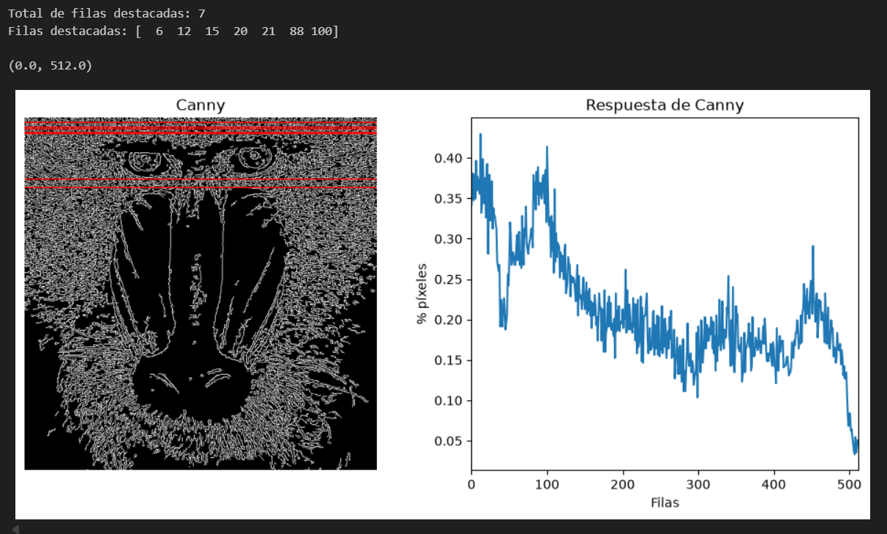
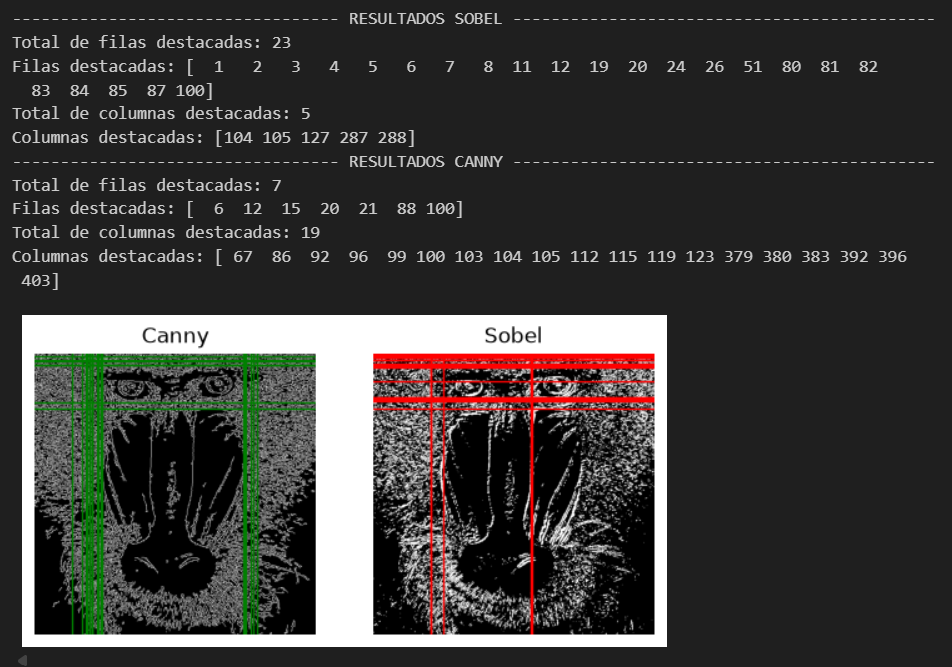
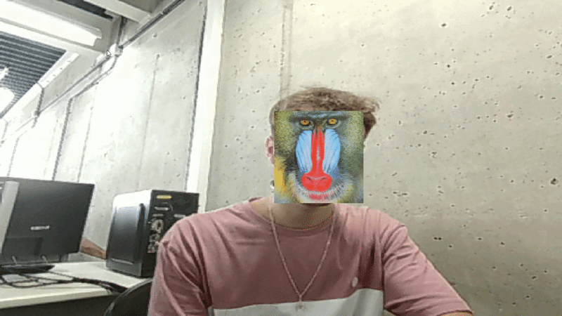

# Práctica 2

Este repositorio contiene el cuaderno `tareas_p2.ipynb`, con tres ejercicios sobre detección de bordes (Canny y Sobel) y una aplicación de detección de rostros en tiempo real con YuNet.

### 👥 Autores:
- [Enrique Sosa Ojeda](https://github.com/Enric1005)
- [Vidal de León Giménez](https://github.com/t3ntox)

------

## Archivos necesarios

- `mandril.jpg` — imagen utilizada en los tres ejercicios.
- `face_detection_yunet_2023mar.onnx` — modelo preentrenado de detección de rostros usado en la Tarea 3 (descargable desde [OpenCV Zoo](https://github.com/opencv/opencv_zoo/tree/main/models/face_detection_yunet)).

## Tarea 1 — Conteo de píxeles blancos por filas con Canny

En esta primera tarea, la imagen se convierte a escala de grises y se le aplica `cv2.Canny(gris, 100, 200)`, obteniendo una imagen binaria (0/255) con los bordes detectados.

Una vez se tiene el resultado, se realiza el conteo de píxeles blancos por fila se hace con `cv2.reduce(canny, 1, cv2.REDUCE_SUM, dtype=cv2.CV_32SC1)`, que suma los valores de cada fila (el `1` indica reducción a lo largo del eje horizontal, colapsando columnas). El resultado, `fil_counts`, es un array de una columna con la suma total de cada fila.

Para expresarlo como porcentaje, se normaliza dividiendo entre `255 * canny.shape[1]` (255 al ser el valor máximo de píxel, y el número de columnas al ser el máximo número de píxeles blancos posibles en una fila).

Se calcula el valor máximo (`umbral = max(fil_counts) * 0.9`) y se seleccionan con `np.where(...)` las filas cuyo conteo lo supera. Estas filas se marcan sobre la imagen de Canny con `plt.axhline()`, una línea horizontal roja por cada fila destacada. En paralelo, se muestra una gráfica de líneas con el porcentaje de píxeles blancos por fila, para visualizar la distribución completa.

### Resultados




## Tarea 2 — Umbralizado de Sobel y comparación con Canny

Una vez ya se conocen los resultados obtenidos con canny, en esta tarea se busca comparar dichos resultado con los que daría otro método de detección de bordes, en este caso el llamado Sobel.

**Cálculo de Sobel:**
1. Se suaviza la imagen en grises con `cv2.GaussianBlur(gris, (3,3), 0)` para reducir ruido de alta frecuencia antes de derivar.
2. Se calculan los gradientes en ambas direcciones con `cv2.Sobel(ggris, cv2.CV_64F, 1, 0)` (horizontal) y `cv2.Sobel(ggris, cv2.CV_64F, 0, 1)` (vertical), usando profundidad `CV_64F` para no perder valores negativos del gradiente.
3. Ambos gradientes se combinan con `cv2.add()` y se convierten a 8 bits con `cv2.convertScaleAbs()`, ya que `cv2.threshold` requiere una imagen de este tipo.
4. Se umbraliza con `cv2.threshold(cvt_sobel, 90, 255, cv2.THRESH_BINARY)`, obteniendo una imagen binaria equivalente a la de Canny.

Tras obtener la imagen resultante, se aplica la misma lógica de `cv2.reduce()` de la Tarea 1, pero esta vez también por columnas (`cv2.reduce(imagenUmbralizada, 0, ...)`, con el `0` indicando reducción por columnas). Se obtienen así cuatro conjuntos: filas y columnas destacadas para Sobel, y filas y columnas destacadas para Canny (recalculado igual que en la Tarea 1).

Con todos los resultados requeridos, se muestran ambas imágenes en subplots (`plt.subplot(1,2,...)`), Canny con líneas verdes (`axhline`/`axvline`) y Sobel umbralizado con líneas rojas, permitiendo comparar visualmente qué filas y columnas destaca cada método.

### Resultados




## Ampliación — Anonimización de rostros en tiempo real con YuNet

Por último, a partir del vídeo **My little privacy** se decidió realizar un detector de rostros que, al rostro detectado superpone una imagen manteniendo la privacidad de las personas que aparecen en cámara. Para ello, investigamos con ayuda de Claude los distintos métodos de detección de rostro que proporciona OpenCV y el método seleccionado fue el uso del modelo preentrenado YuNet.

**Inicialización del detector:**
```python
detector = cv2.FaceDetectorYN.create(
    "face_detection_yunet_2023mar.onnx", "", (320, 320),
    score_threshold=0.6, nms_threshold=0.3, top_k=5000
)
```
- `score_threshold=0.6`: umbral de confianza para aceptar una detección como rostro.
- `nms_threshold=0.3`: umbral de solapamiento (IoU) usado en la supresión de no-máximos para eliminar cajas duplicadas sobre el mismo rostro.
- `top_k=5000`: número máximo de candidatos considerados antes de aplicar la supresión de no-máximos.

**Bucle principal:**
1. Se captura vídeo de la webcam con `cv2.VideoCapture(0)`.
2. En cada frame, se ajusta el tamaño de entrada del detector a las dimensiones reales del frame (`detector.setInputSize((img_w, img_h))`) y se ejecuta `detector.detect(frame)`.
3. Por cada rostro detectado, se extraen las coordenadas del bounding box (`face[0:4]`) y se recortan (clip) a los límites del frame con `max(0, x)` y `min(w, img_w - x)`, evitando errores de slicing cuando el rostro está cerca del borde de la imagen.
4. La imagen `mandril.jpg` se redimensiona al tamaño exacto del bounding box con `cv2.resize(..., interpolation=cv2.INTER_AREA)` y se copia sobre esa región del frame (`frame[y:y+h, x:x+w] = overlay_resized`), ocultando el rostro original.
5. El resultado se muestra en una ventana con `cv2.imshow()`, y el bucle termina al pulsar `Esc` (`cv2.waitKey(20) == 27`), liberando la cámara y cerrando las ventanas al finalizar.

### Resultados


